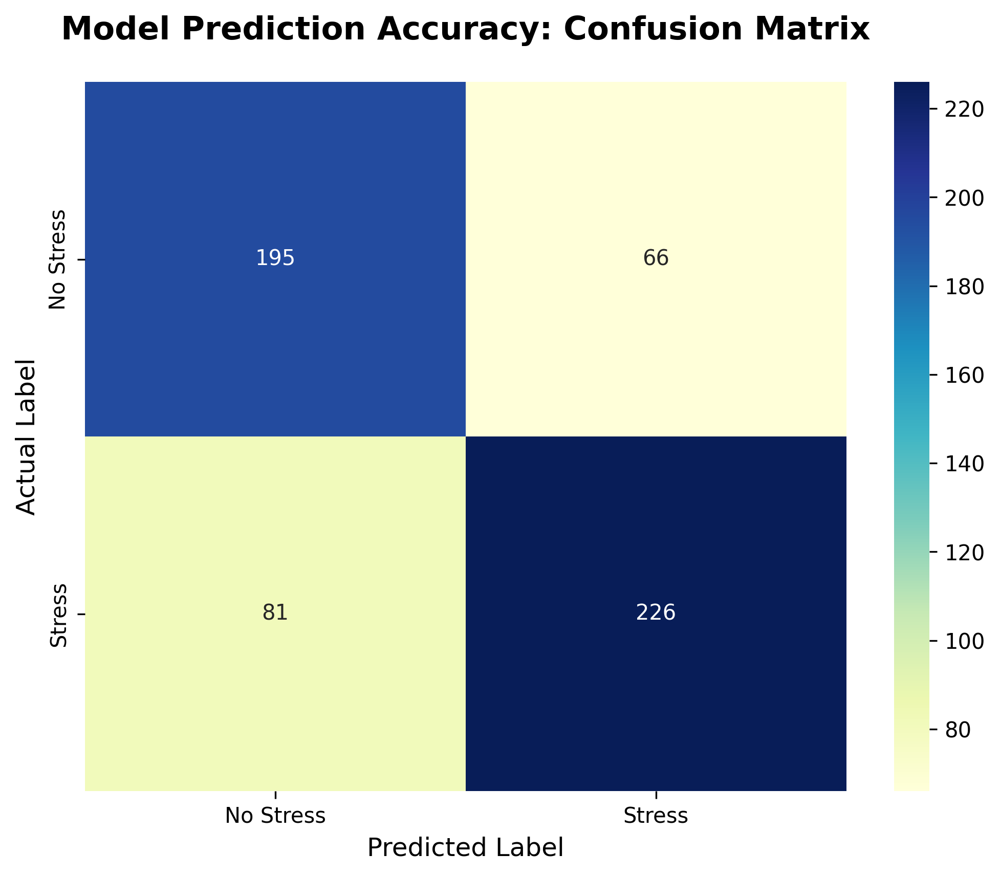

# Stress Detection in Social Media Posts 🧠

This Machine Learning project classifies Reddit posts into 'Stress' or 'No Stress' categories using Natural Language Processing (NLP).

## 🚀 Features
- **Text Preprocessing:** Cleaned raw social media text (removing URLs, special characters, and lowercasing).
- **Feature Extraction:** Implemented TF-IDF Vectorization to convert text into numerical data.
- **Classification:** Used a Logistic Regression model to achieve high predictive accuracy.
- **Statistical Analysis:** Included Mean, Median, and Mode analysis of post lengths and sentiments.

## 📊 Results
- **Model Accuracy:** 75.53%
- **Insights:** The model performs consistently across both classes, as shown in the Confusion Matrix below.

## 🛠️ Tech Stack
- **Language:** Python
- **Libraries:** Pandas, Scikit-learn, Seaborn, Matplotlib, Regex
